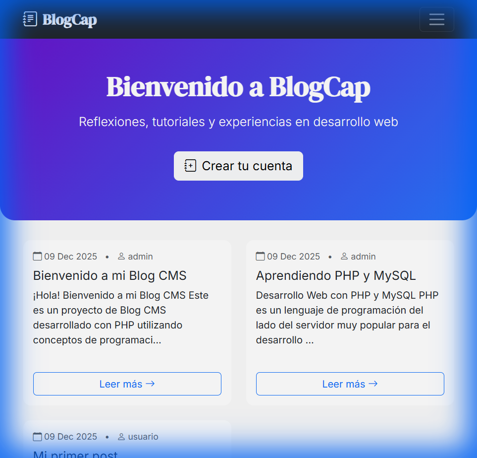

# 📝 BlogCap - Sistema de Gestión de Contenido (CMS)

> **Curso**: DAM  
> **Estudiante**: Luis Cape  
> **Fecha**: Diciembre 2025

Sistema de gestión de contenido (CMS) para un blog personal, desarrollado en **PHP puro**, con enfoque en buenas prácticas: POO, enrutamiento limpio, seguridad y separación de capas.



---

## 🛠️ Tecnologías Usadas

| Capa          | Tecnología                 |
| ------------- | -------------------------- |
| Backend       | PHP 8.1+                   |
| Base de datos | MySQL 5.7+                 |
| Servidor      | Apache (con `mod_rewrite`) |
| Frontend      | HTML5, CSS3, Bootstrap 5   |
| IDE           | Visual Studio Code         |

---

## 📦 Instalación Local

### Requisitos Previos

- **Servidor local**: [XAMPP](https://www.apachefriends.org/), [WAMP](http://www.wampserver.com/) o [Laragon](https://laragon.org/)
- **MySQL** activo
- **Apache** con `mod_rewrite` habilitado
- **PHP 8.1** o superior

### Pasos de Instalación

#### 1️⃣ Clonar o descargar el repositorio

```bash
git clone https://github.com/Capel23/ProyectoPHP.git
```

O descarga el ZIP y extráelo en `C:\xampp\htdocs\` (Windows) o `/var/www/html/` (Linux/Mac).

#### 2️⃣ Configurar la base de datos

1. **Iniciar XAMPP** y activar **Apache** y **MySQL**

2. **Importar la base de datos**:

   - Abre **phpMyAdmin** en tu navegador: `http://localhost/phpmyadmin`
   - Clic en "**Nueva**" para crear una nueva base de datos
   - O directamente ejecuta el archivo SQL:
     - Clic en "**Importar**"
     - Selecciona el archivo `sql/blog_cm.sql`
     - Clic en "**Continuar**"

   **Nota**: El archivo SQL ya crea automáticamente la base de datos `blog_cms` con:

   - ✅ Tablas `users` y `posts`
   - ✅ 2 usuarios de ejemplo
   - ✅ 3 posts de ejemplo

#### 3️⃣ Configurar las credenciales de conexión

1. Duplica el archivo de configuración de ejemplo:

   ```bash
   cp config/database.example.php config/database.php
   ```

   O en Windows:

   ```cmd
   copy config\database.example.php config\database.php
   ```

2. Edita `config/database.php` con tus credenciales de MySQL:

   ```php
   <?php
   return [
       'host'     => 'localhost',
       'dbname'   => 'blog_cms',
       'username' => 'root',           // ← Cambia si es necesario
       'password' => '',               // ← Agrega tu contraseña de MySQL
       'charset'  => 'utf8mb4'
   ];
   ```

   **Configuración típica de XAMPP**:

   - `username`: `root`
   - `password`: `` (vacío por defecto)

#### 4️⃣ Verificar configuración de Apache

**Asegúrate de que `mod_rewrite` esté habilitado**:

1. Abre `C:\xampp\apache\conf\httpd.conf`
2. Busca la línea:
   ```apache
   #LoadModule rewrite_module modules/mod_rewrite.so
   ```
3. **Elimina el `#`** si está comentada:
   ```apache
   LoadModule rewrite_module modules/mod_rewrite.so
   ```
4. Guarda el archivo y **reinicia Apache** desde el panel de XAMPP.

#### 5️⃣ Acceder al proyecto

Abre tu navegador y ve a:

```
http://localhost/ProyectoPHP/public/
```

🎉 **¡Listo!** Deberías ver la página principal del blog con los posts de ejemplo.

---

## 👤 Usuarios de Prueba

El sistema incluye dos usuarios de prueba:

| Usuario     | Email             | Contraseña |
| ----------- | ----------------- | ---------- |
| **admin**   | admin@example.com | admin123   |
| **usuario** | user@example.com  | usuario123 |

### Iniciar sesión

1. Ve a: `http://localhost/ProyectoPHP/public/login`
2. Usa cualquiera de las credenciales anteriores
3. Accede al **panel de administración**: `http://localhost/ProyectoPHP/public/admin/posts`

---

## 📂 Estructura del Proyecto

```
ProyectoPHP/
├── config/                  # Configuraciones
│   ├── database.php        # Credenciales de BD (no subir a Git)
│   └── database.example.php # Ejemplo de configuración
├── public/                 # Punto de entrada público
│   ├── .htaccess          # Reglas de reescritura de Apache
│   └── index.php          # Router principal
├── sql/                   # Scripts de base de datos
│   └── blog_cm.sql       # Schema + datos de ejemplo
├── src/                  # Código fuente
│   ├── Controllers/      # Controladores
│   ├── Core/            # Clases del núcleo (Router, Database, etc.)
│   ├── Models/          # Modelos (User, Post)
│   └── Views/           # Vistas HTML
└── docs/                # Documentación
```

---

## 🚀 Características

### Backend

- ✅ **Routing personalizado** con URLs amigables
- ✅ **OOP** (Programación Orientada a Objetos)
- ✅ **PDO** con consultas preparadas (seguridad SQL Injection)
- ✅ **Autenticación** con sesiones
- ✅ **Password hashing** con `password_hash()` y `password_verify()`
- ✅ **Subida de imágenes** con validación
- ✅ **CRUD completo** para posts

### Frontend

- ✅ **Bootstrap 5** para diseño responsivo
- ✅ **Separación de lógica y presentación** (MVC)
- ✅ **Sanitización de datos** con `htmlspecialchars()`

---

## 🔧 Solución de Problemas

### ❌ Error 404 - Página no encontrada

**Causa**: `mod_rewrite` no está habilitado o el `.htaccess` no se está leyendo.

**Solución**:

1. Verifica que `mod_rewrite` esté habilitado (ver paso 4️⃣)
2. Asegúrate de que el archivo `public/.htaccess` exista
3. Verifica que `AllowOverride All` esté configurado en `httpd.conf`:
   ```apache
   <Directory "C:/xampp/htdocs">
       AllowOverride All
   </Directory>
   ```

### ❌ No se conecta a la base de datos

**Solución**:

1. Verifica que MySQL esté activo en XAMPP
2. Revisa las credenciales en `config/database.php`
3. Asegúrate de haber importado `sql/blog_cm.sql` correctamente

### ❌ Página en blanco o error PHP

**Solución**:

1. Activa los errores de PHP editando `public/index.php`:
   ```php
   <?php
   error_reporting(E_ALL);
   ini_set('display_errors', 1);
   ```
2. Revisa el log de errores de Apache: `C:\xampp\apache\logs\error.log`

---

## 📝 Notas de Seguridad

⚠️ **IMPORTANTE**: Este proyecto es para **fines educativos**.

Para usar en producción, considera:

- Usar **variables de entorno** para credenciales (`.env`)
- Implementar **protección CSRF**
- Agregar **rate limiting** en login
- Usar **HTTPS**
- Implementar **validación del lado del servidor** más robusta

---

## 📧 Contacto

**Desarrollador**: Luis Capel  
**GitHub**: [@Capel23](https://github.com/Capel23)

---

## 📄 Licencia

Este proyecto es de código abierto para fines educativos.
